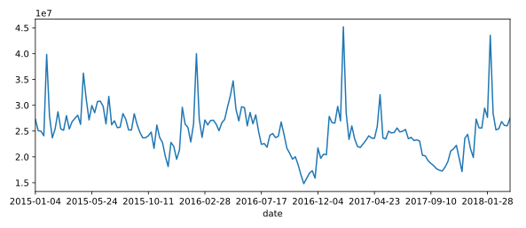

## Changes in sales over time

Line plots are designed to visualize the relationship between two numeric variables, where each data values is connected to the next one. They are especially useful for visualizing change in a number over time, since each time point is naturally connected to the next time point. In this exercise, you'll visualize the change in avocado sales over three years.

`pandas` has been imported as `pd`.

<hr>

**Instructions**

* Get the total number of avocados sold on each date. *The DataFrame has two rows for each date -- one for organic, and one for conventional*. Save this as `nb_sold_by_date`.
* Create a line plot of the number of avocados sold.
* Show the plot.

## Script
```
# Import matplotlib.pyplot with alias plt
import matplotlib.pyplot as plt

print(avocados.head())
# Get the total number of avocados sold on each date
nb_sold_by_date = avocados.groupby('date')['nb_sold'].sum()

# Create a line plot of the number of avocados sold by date
nb_sold_by_date.plot(kind='line')

# Show the plot
plt.show()
```

## Output
```
         date          type  year  avg_price   size    nb_sold
0  2015-12-27  conventional  2015       0.95  small  9.627e+06
1  2015-12-20  conventional  2015       0.98  small  8.710e+06
2  2015-12-13  conventional  2015       0.93  small  9.855e+06
3  2015-12-06  conventional  2015       0.89  small  9.405e+06
4  2015-11-29  conventional  2015       0.99  small  8.095e+06
```

## Plots
