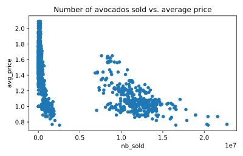

## Avocado supply and demand

Scatter plots are ideal for visualizing relationships between numerical variables. In this exercise, you'll compare the number of avocados sold to average price and see if they're at all related. If they're related, you may be able to use one number to predict the other.

`matplotlib.pyplot` has been imported as `plt` and `pandas` has been imported as `pd`.

<hr>

**Instructions**

* Create a scatter plot with `nb_sold` on the x-axis and `avg_price` on the y-axis. Title it `"Number of avocados sold vs. average price"`.
* Show the plot.

## Script
```
# Scatter plot of nb_sold vs avg_price with title
avocados.plot(kind='scatter', x='nb_sold', y='avg_price', title='Number of avocados sold vs. average price')

# Show the plot
plt.show()
```

## Plots
