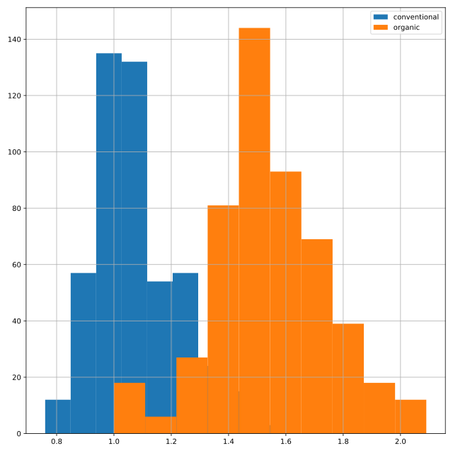
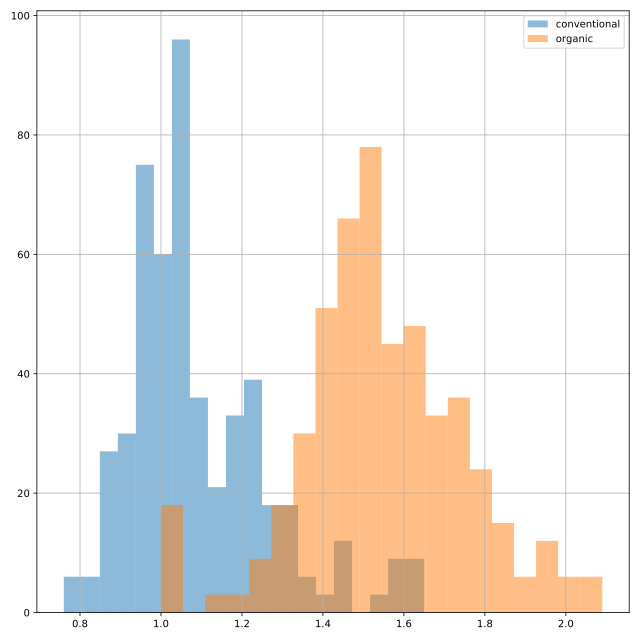

## Price of conventional vs. organic avocados

Creating multiple plots for different subsets of data allows you to compare groups. In this exercise, you'll create multiple histograms to compare the prices of conventional and organic avocados.

`matplotlib.pyplot` has been imported as `plt` and `pandas` has been imported as `pd`.

<hr>

**Instructions 1/3**
* Subset `avocados` for the conventional type, and the average price column. Create a histogram.
* Create a histogram of `avg_price` for organic type avocados.
* Add a legend to your plot, with names "conventional" and "organic".
* Show your plot.

**Instructions 2/3**
* Modify your code to adjust the transparency of both histograms to `0.5` to see how much overlap there is between the two distributions.

**Instructions 3/3**
* Modify your code to use 20 bins in both histograms.

## Script
```
# Histogram of conventional avg_price
avocados[avocados['type']=='conventional']['avg_price'].hist()

# Histogram of organic avg_price
avocados[avocados['type']=='organic']['avg_price'].hist()

# Add a legend
plt.legend(['conventional','organic'])

# Show the plot
plt.show()
```
```
# Modify histogram transparency to 0.5
avocados[avocados["type"] == "conventional"]["avg_price"].hist(alpha=.5)

# Modify histogram transparency to 0.5
avocados[avocados["type"] == "organic"]["avg_price"].hist(alpha=.5)

# Add a legend
plt.legend(["conventional", "organic"])

# Show the plot
plt.show()
```
```
# Modify bins to 20
avocados[avocados["type"] == "conventional"]["avg_price"].hist(alpha=0.5, bins=20)

# Modify bins to 20
avocados[avocados["type"] == "organic"]["avg_price"].hist(alpha=0.5, bins=20)

# Add a legend
plt.legend(["conventional", "organic"])

# Show the plot
plt.show()
```

## Plots


