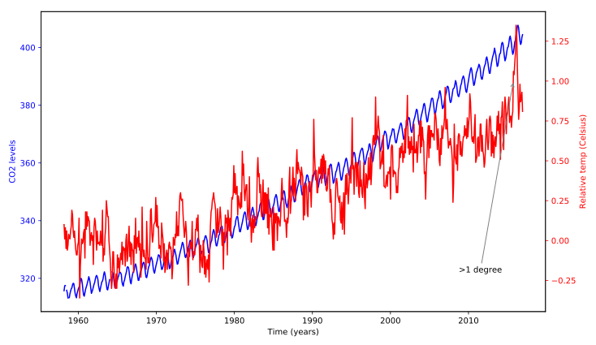

## Plotting time-series: putting it all together

In this exercise, you will plot two time-series with different scales on the same Axes, and annotate the data from one of these series.

The CO2/temperatures data is provided as a DataFrame called `climate_change`. You should also use the function that we have defined before, called `plot_timeseries`, which takes an Axes object (as the `axes` argument) plots a time-series (provided as `x` and `y` arguments), sets the labels for the x-axis and y-axis and sets the color for the data, and for the y tick/axis labels:

> ```
> plot_timeseries(axes, x, y, color, xlabel, ylabel)
> ```

Then, you will annotate with text an important time-point in the data: on 2015-10-06, when the temperature first rose to above 1 degree over the average.

**Instructions**
* Use the `plot_timeseries` function to plot CO2 levels against time. Set xlabel to `"Time (years)"` ylabel to `"CO2 levels"` and color to `'blue'`.
* Create `ax2`, as a twin of the first Axes.
* In `ax2`, plot temperature against time, setting the color ylabel to `"Relative temp (Celsius)"` and color to `'red'`.
* Annotate the data using the `ax2.annotate` method. Place the text `">1 degree"` in `x=pd.Timestamp('2008-10-06'`), y=`-0.2` pointing with a gray thin arrow to `x=pd.Timestamp('2015-10-06')`, y=`1`.

## Script
```
fig, ax = plt.subplots()

# Plot the CO2 levels time-series in blue
plot_timeseries(ax, climate_change.index, climate_change.co2, 'blue', 'Time (years)', 'CO2 levels')

# Create an Axes object that shares the x-axis
ax2 = ax.twinx()

# Plot the relative temperature data in red
plot_timeseries(ax2, climate_change.index, climate_change.relative_temp, 'red', 'Time (years)', 'Relative temp (Celsius)')

# Annotate point with relative temperature >1 degree
ax2.annotate(">1 degree", xy=(pd.Timestamp('2015-10-06'),1), xytext=(pd.Timestamp('2008-10-06'),-0.2), arrowprops={'arrowstyle': '->', 'color': 'gray'})

plt.show()
```

## Output
