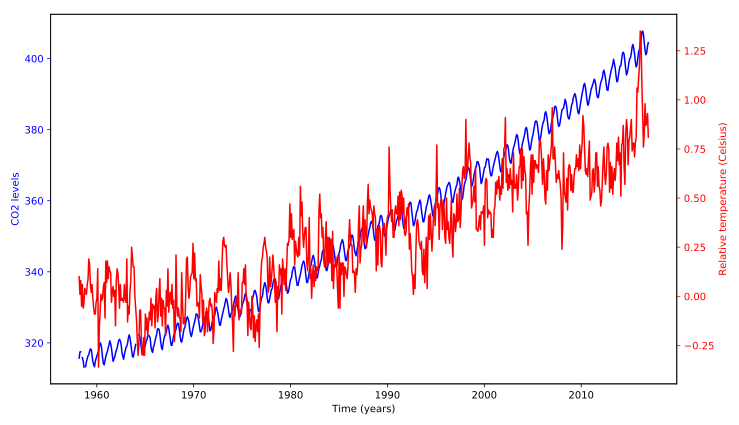

## Using a plotting function

Defining functions allows us to reuse the same code without having to repeat all of it. Programmers sometimes say "Don't repeat yourself".

In the previous exercise, you defined a function called plot_timeseries:

> ```
> plot_timeseries(axes, x, y, color, xlabel, ylabel)
> ```

that takes an Axes object (as the argument `axes`), time-series data (as `x` and `y` arguments) the name of a `color` (as a string, provided as the color argument) and x-axis and y-axis labels (as `xlabel` and `ylabel` arguments). In this exercise, the function `plot_timeseries` is already defined and provided to you.

Use this function to plot the `climate_change` time-series data, provided as a Pandas DataFrame object that has a DateTimeIndex with the dates of the measurements and `co2` and `relative_temp` columns.

**Instructions**

* In the provided `ax` object, use the function `plot_timeseries` to plot the `"co2"` column in blue, with the x-axis label `"Time (years)"` and y-axis label `"CO2 levels"`.
* Use the `ax.twinx` method to add an Axes object to the figure that shares the x-axis with ax.
* Use the function `plot_timeseries` to add the data in the `"relative_temp"` column in red to the twin Axes object, with the x-axis label `"Time (years)"` and y-axis label `"Relative temperature (Celsius)"`.

## Script
```
fig, ax = plt.subplots()

# Plot the CO2 levels time-series in blue
plot_timeseries(ax, climate_change.index, climate_change['co2'], "blue", "Time (years)", "CO2 levels")

# Create a twin Axes object that shares the x-axis
ax2 = ax.twinx()

# Plot the relative temperature data in red
plot_timeseries(ax2, climate_change.index, climate_change['relative_temp'], "red", "Time (years)", "Relative temperature (Celsius)")

plt.show()
```

## Output
