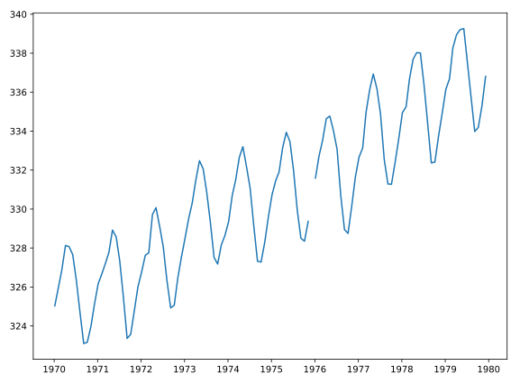

## Using a time index to zoom in

When a time-series is represented with a time index, we can use this index for the x-axis when plotting. We can also select a to zoom in on a particular period within the time-series using Pandas' indexing facilities. In this exercise, you will select a portion of a time-series dataset and you will plot that period.

The data to use is stored in a DataFrame called `climate_change`, which has a time-index with dates of measurements and two data columns: `"co2"` and `"relative_temp"`.

**Instructions**

* Use `plt.subplots` to create a Figure with one Axes called `fig` and `ax`, respectively.
* Create a variable called `seventies` that includes all the data between `"1970-01-01"` and `"1979-12-31"`.
* Add the data from `seventies` to the plot: use the DataFrame `index` for the x value and the `"co2"` column for the y values.

## Script
```
import matplotlib.pyplot as plt

# Use plt.subplots to create fig and ax
fig, ax = plt.subplots()

# Create variable seventies with data from "1970-01-01" to "1979-12-31"
seventies = climate_change["1970-01-01":"1979-12-31"]

# Add the time-series for "co2" data from seventies to the plot
ax.plot(seventies.index, seventies["co2"])

# Show the figure
plt.show()
```

## Output
