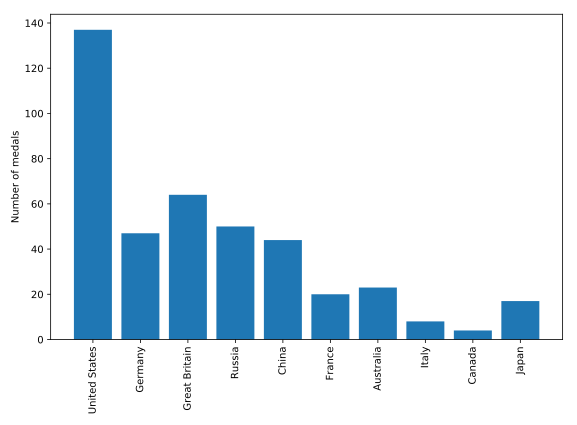

Bar chart

Bar charts visualize data that is organized according to categories as a series of bars, where the height of each bar represents the values of the data in this category.

For example, in this exercise, you will visualize the number of gold medals won by each country in the provided `medals` DataFrame. The DataFrame contains the countries as the index, and a column called `"Gold"` that contains the number of gold medals won by each country, according to their rows.

**Instructions**

* Call the `ax.bar` method to plot the `"Gold"` column as a function of the country.
* Use the `ax.set_xticklabels` to set the x-axis tick labels to be the country names.
* In the call to `ax.set_xticklabels` rotate the x-axis tick labels by 90 degrees by using the rotation key-word argument.
* Set the y-axis label to `"Number of medals"`.

## Script
```
fig, ax = plt.subplots()

# Plot a bar-chart of gold medals as a function of country
ax.bar(medals.index, medals.Gold)

# Set the x-axis tick labels to the country names
ax.set_xticklabels(medals.index, rotation=90)

# Set the y-axis label
ax.set_ylabel('Number of medals')

plt.show()
```

## Output
