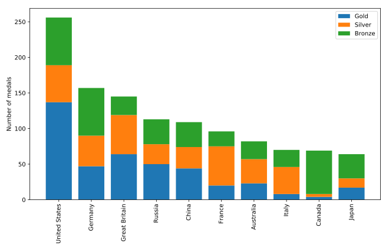

## Stacked bar chart

A stacked bar chart contains bars, where the height of each bar represents values. In addition, stacked on top of the first variable may be another variable. The *additional* height of this bar represents the value of this variable. And you can add more bars on top of that.

In this exercise, you will have access to a DataFrame called `medals` that contains an index that holds the names of different countries, and three columns: `"Gold"`, `"Silver"` and `"Bronze"`. You will also have a Figure, `fig`, and Axes, `ax`, that you can add data to.

You will create a stacked bar chart that shows the number of gold, silver, and bronze medals won by each country, and you will add labels and create a legend that indicates which bars represent which medals.

**Instructions**

* Call the `ax.bar` method to add the `"Gold"` medals. Call it with the `label` set to `"Gold"`.
* Call the `ax.bar` method to stack `"Silver"` bars on top of that, using the `bottom` key-word argument so the bottom of the bars will be on top of the gold medal bars, and `label` to add the label `"Silver"`.
* Use `ax.bar` to add `"Bronze"` bars on top of that, using the `bottom` key-word and `label` it as `"Bronze"`.

## Script
```
# Add bars for "Gold" with the label "Gold"
ax.bar(medals.index, medals.Gold, label='Gold')

# Stack bars for "Silver" on top with label "Silver"
ax.bar(medals.index, medals.Silver, bottom=medals.Gold, label='Silver')

# Stack bars for "Bronze" on top of that with label "Bronze"
ax.bar(medals.index, medals.Bronze, bottom=medals.Gold + medals.Silver, label='Bronze')

# Display the legend
ax.legend()

plt.show()
```

## Output
