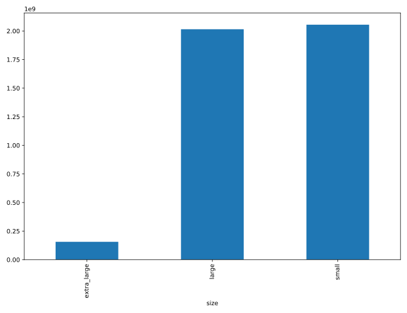

## Which avocado size is most popular?

Avocados are increasingly popular and delicious in guacamole and on toast. The Hass Avocado Board keeps track of avocado supply and demand across the USA, including the sales of three different sizes of avocado. In this exercise, you'll use a bar plot to figure out which size is the most popular.

Bar plots are great for revealing relationships between categorical (size) and numeric (number sold) variables, but you'll often have to manipulate your data first in order to get the numbers you need for plotting.

`pandas` has been imported as `pd`, and `avocados` is available.

<hr>

**Instructions**

* Print the head of the `avocados` dataset. What columns are available?
* For each avocado size group, calculate the total number sold, storing as `nb_sold_by_size`.
* Create a bar plot of the number of avocados sold by size.
* Show the plot.

## Script
```
# Import matplotlib.pyplot with alias plt
import matplotlib.pyplot as plt

# Look at the first few rows of data
print(avocados.head())

# Get the total number of avocados sold of each size
nb_sold_by_size = avocados.groupby('size')['nb_sold'].sum()

# Create a bar plot of the number of avocados sold by size
nb_sold_by_size.plot(kind='bar')

# Show the plot
plt.show()
```

## Plots
