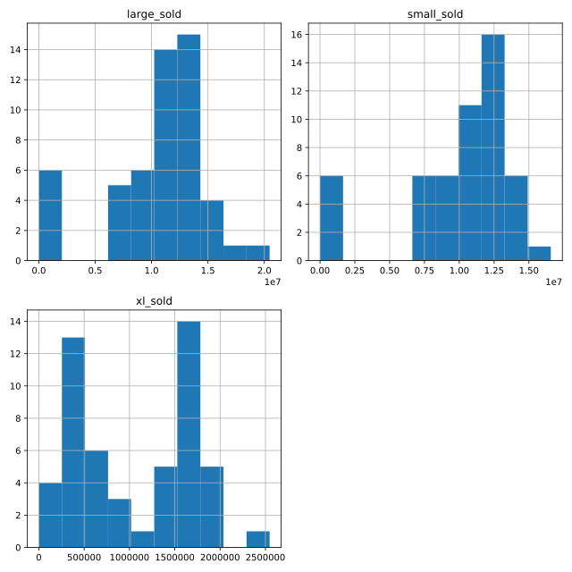

## Replacing missing values

Another way of handling missing values is to replace them all with the same value. For numerical variables, one option is to replace values with 0—you'll do this here. However, when you replace missing values, you make assumptions about what a missing value means. In this case, you will assume that a missing number sold means that no sales for that avocado type were made that week.

In this exercise, you'll see how replacing missing values can affect the distribution of a variable using histograms. You can plot histograms for multiple variables at a time as follows:

> dogs[["height_cm", "weight_kg"]].hist()

`pandas` has been imported as `pd` and `matplotlib.pyplot` has been imported as `plt`.

<hr>

**Instructions 1/2**
* Create a list, `cols_with_missing`, naming the columns with missing values: `"small_sold"`, `"large_sold"`, and `"xl_sold"`.
* Create a histogram of those columns.
* Show the plot.

**Instructions 2/2**
* Replace the missing values of `avocados_2016` with `0`s and store the result as `avocados_filled`.
* Create a histogram of the `cols_with_missing` columns of `avocados_filled`.


## Script
```
# List the columns with missing values
cols_with_missing = ['small_sold','large_sold','xl_sold']

# Create histograms showing the distributions cols_with_missing
avocados_2016[cols_with_missing].hist()

# Show the plot
plt.show()
```
```
# From previous step
cols_with_missing = ["small_sold", "large_sold", "xl_sold"]
avocados_2016[cols_with_missing].hist()
plt.show()

# Fill in missing values with 0
avocados_filled = avocados_2016.fillna(0)

# Create histograms of the filled columns
avocados_filled[cols_with_missing].hist()

# Show the plot
plt.show()
```

## Plots

