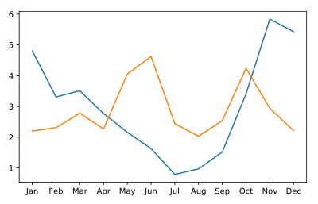

## Adding data to an Axes object

Adding data to a figure is done by calling methods of the `Axes` object. In this exercise, we will use the `plot` method to add data about rainfall in two American cities: Seattle, WA and Austin, TX.

The data are stored in two Pandas DataFrame objects that are already loaded into memory: `seattle_weather` stores information about the weather in Seattle, and `austin_weather` stores information about the weather in Austin. Each of the data frames has a `MONTHS` column that stores the three-letter name of the months. Each also has a column named "MLY-PRCP-NORMAL" that stores the average rainfall in each month during a ten-year period.

In this exercise, you will create a visualization that will allow you to compare the rainfall in these two cities.

**Instructions**

* Import the matplotlib.pyplot submodule as plt.
* Create a Figure and an Axes object by calling plt.subplots.
* Add data from the seattle_weather DataFrame by calling the Axes plot method.
* Add data from the austin_weather DataFrame in a similar manner and call plt.show to show the results.

## script.py
```
# Import the matplotlib.pyplot submodule and name it plt
import matplotlib.pyplot as plt

# Create a Figure and an Axes with plt.subplots
fig, ax = plt.subplots()

# Plot MLY-PRCP-NORMAL from seattle_weather against the MONTH
ax.plot(seattle_weather["MONTH"], seattle_weather["MLY-PRCP-NORMAL"])

# Plot MLY-PRCP-NORMAL from austin_weather against MONTH
ax.plot(austin_weather["MONTH"], austin_weather["MLY-PRCP-NORMAL"])

# Call the show function
plt.show()
```

## Output
