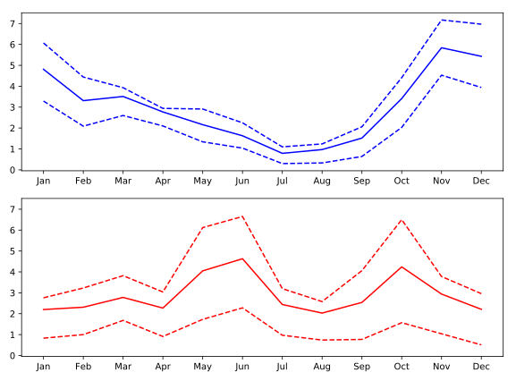

## Small multiples with shared y axis

When creating small multiples, it is often preferable to make sure that the different plots are displayed with the same scale used on the y-axis. This can be configured by setting the `sharey` key-word to `True`.

In this exercise, you will create a Figure with two Axes objects that share their y-axis. As before, the data is provided in `seattle_weather` and austin_weather `DataFrames`.

**Instructions**

* Create a Figure with an array of two Axes objects that share their y-axis range.
* Plot Seattle's "MLY-PRCP-NORMAL" in a solid blue line in the top Axes.
* Add Seattle's "MLY-PRCP-25PCTL" and "MLY-PRCP-75PCTL" in dashed blue lines to the top Axes.
* Plot Austin's "MLY-PRCP-NORMAL" in a solid red line in the top Axes and the "MLY-PRCP-25PCTL" and "MLY-PRCP-75PCTL" in dashed red lines.

## script.py
```
# Create a figure and an array of axes: 2 rows, 1 column with shared y axis
fig, ax = plt.subplots(2, 1, sharey=True)

# Plot Seattle precipitation data in the top axes
ax[0].plot(seattle_weather['MONTH'], seattle_weather['MLY-PRCP-NORMAL'], color = 'b')
ax[0].plot(seattle_weather['MONTH'], seattle_weather['MLY-PRCP-25PCTL'], color = 'b', linestyle = '--')
ax[0].plot(seattle_weather['MONTH'], seattle_weather['MLY-PRCP-75PCTL'], color = 'b', linestyle = '--')

# Plot Austin precipitation data in the bottom axes
ax[1].plot(austin_weather['MONTH'], austin_weather['MLY-PRCP-NORMAL'], color = 'r')
ax[1].plot(austin_weather['MONTH'], austin_weather['MLY-PRCP-25PCTL'], color = 'r', linestyle = '--')
ax[1].plot(austin_weather['MONTH'], austin_weather['MLY-PRCP-75PCTL'], color = 'r', linestyle = '--')

plt.show()
```

## Output
