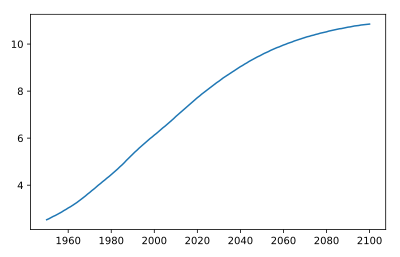

## Line plot (1)

With matplotlib, you can create a bunch of different plots in Python. The most basic plot is the line plot. A general recipe is given here.

> import matplotlib.pyplot as plt
> plt.plot(x,y)
> plt.show()

In the video, you already saw how much the world population has grown over the past years. Will it continue to do so? The world bank has estimates of the world population for the years 1950 up to 2100. The years are loaded in your workspace as a list called `year`, and the corresponding populations as a list called `pop`.

*This course touches on a lot of concepts you may have forgotten, so if you ever need a quick refresher, download the [Python for data science Cheat Sheet](https://datacamp-community-prod.s3.amazonaws.com/e30fbcd9-f595-4a9f-803d-05ca5bf84612) and keep it handy!*

<hr>

**Instructions**
* `print()` the last item from both the `year` and the `pop` list to see what the predicted population for the year 2100 is. Use two `print()` functions.
* Before you can start, you should import `matplotlib.pyplot` as `plt`. `pyplot` is a sub-package of `matplotlib`, hence the dot.
* Use `plt.plot()` to build a line plot. year should be mapped on the horizontal axis, pop on the vertical axis. Don't forget to finish off with the `show()` function to actually display the plot.

## Script
```
# Print the last item from year and pop
print(year[-1])
print(pop[-1])

# Import matplotlib.pyplot as plt
import matplotlib.pyplot as plt

# Make a line plot: year on the x-axis, pop on the y-axis
plt.plot(year, pop)

# Display the plot with plt.show()
plt.show()
```

## Output
```
<script.py> output:
    2100
    10.85
```

## Plots
