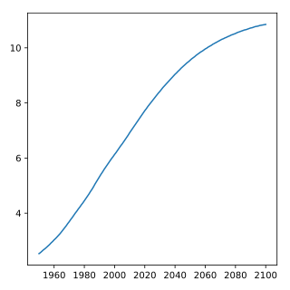

## Line Plot (2): Interpretation

Have another look at the plot you created in the previous exercise; it's shown on the right. Based on the plot, in **approximately** what year will there be more than ten billion human beings on this planet?

**Instructions**

> **Possible Answers**
>
> * 2040
> * 2060
> * 2085
> * 2095
>
> **Answer**
> > 2060

## Plots
