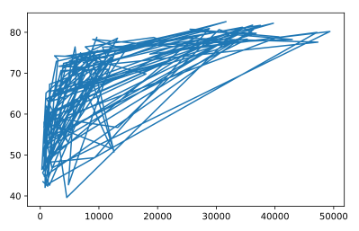

## Line plot (3)

Now that you've built your first line plot, let's start working on the data that professor Hans Rosling used to build his beautiful bubble chart. It was collected in 2007. Two lists are available for you:

* `life_exp` which contains the life expectancy for each country and
* `gdp_cap`, which contains the GDP per capita (i.e. per person) for each country expressed in US Dollars.

GDP stands for Gross Domestic Product. It basically represents the size of the economy of a country. Divide this by the population and you get the GDP per capita.

`matplotlib.pyplot` is already imported as `plt`, so you can get started straight away.

<hr>

**Instructions**
* Print the last item `from` both the list gdp_cap, and the list `life_exp`; it is information about Zimbabwe.
* Build a line chart, with `gdp_cap` on the x-axis, and `life_exp` on the y-axis. Does it make sense to plot this data on a line plot?
* Don't forget to finish off with a `plt.show()` command, to actually display the plot.

## Script
```
# Print the last item of gdp_cap and life_exp
print(gdp_cap[-1])
print(life_exp[-1])

# Make a line plot, gdp_cap on the x-axis, life_exp on the y-axis
plt.plot(gdp_cap, life_exp)

# Display the plot
plt.show()
```

## Output
```
<script.py> output:
    469.70929810000007
    43.487
```

## Plots
