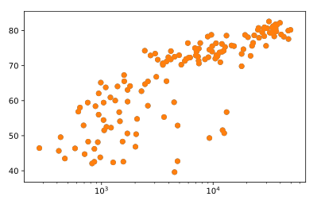

## Scatter Plot (1)

When you have a time scale along the horizontal axis, the line plot is your friend. But in many other cases, when you're trying to assess if there's a correlation between two variables, for example, the scatter plot is the better choice. Below is an example of how to build a scatter plot.

> import matplotlib.pyplot as plt\
> plt.scatter(x,y)\
> plt.show()

Let's continue with the `gdp_cap` versus `life_exp` plot, the GDP and life expectancy data for different countries in 2007. Maybe a scatter plot will be a better alternative?

Again, the `matplotlib.pyplot` package is available as `plt`.

<hr>

**Instructions**
* Change the line plot that's coded in the script to a scatter plot.
* A correlation will become clear when you display the GDP per capita on a logarithmic scale. Add the line `plt.xscale('log')`.
* Finish off your script with `plt.show()` to display the plot.

## Script
```
# Change the line plot below to a scatter plot
plt.scatter(gdp_cap, life_exp)

# Put the x-axis on a logarithmic scale
plt.xscale('log')

# Show plot
plt.show()
```

## Plots
