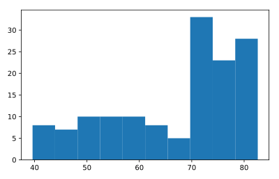

## Build a histogram (1)

`life_exp`, the list containing data on the life expectancy for different countries in 2007, is available in your Python shell.

To see how life expectancy in different countries is distributed, let's create a histogram of `life_exp`.

`matplotlib.pyplot` is already available as `plt`.

<hr>

**Instructions**
* Use `plt.hist()` to create a histogram of the values in `life_exp`. Do not specify the number of bins; Python will set the number of bins to 10 by default for you.
* Add `plt.show()` to actually display the histogram. Can you tell which bin contains the most observations?

## Script
```
# Create histogram of life_exp data
plt.hist(life_exp)

# Display histogram
plt.show()
```
s
## Plots
