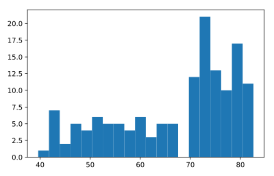

## Build a histogram (2): bins

In the previous exercise, you didn't specify the number of bins. By default, Python sets the number of bins to 10 in that case. The number of bins is pretty important. Too few bins will oversimplify reality and won't show you the details. Too many bins will overcomplicate reality and won't show the bigger picture.

To control the number of bins to divide your data in, you can set the `bins` argument.

That's exactly what you'll do in this exercise. You'll be making two plots here. The code in the script already includes `plt.show()` and `plt.clf(`) calls; `plt.show()` displays a plot; `plt.clf()` cleans it up again so you can start afresh.

As before, `life_exp` is available and `matplotlib.pyplot` is imported as `plt`.

<hr>

**Instructions**
* Build a histogram of `life_exp`, with `5` bins. Can you tell which bin contains the most observations?
* Build another histogram of `life_exp`, this time with `20` bins. Is this better?

## Script
```
# Build histogram with 5 bins
plt.hist(life_exp, bins=5)

# Show and clean up plot
plt.show()
plt.clf()

# Build histogram with 20 bins
plt.hist(life_exp, bins=20)

# Show and clean up again
plt.show()
plt.clf()
```

## Plots
