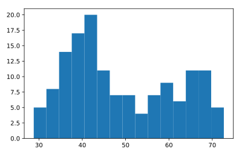

## Build a histogram (3): compare

In the video, you saw population pyramids for the present day and for the future. Because we were using a histogram, it was very easy to make a comparison.

Let's do a similar comparison. `life_exp` contains life expectancy data for different countries in 2007. You also have access to a second list now, `life_exp1950`, containing similar data for 1950. Can you make a histogram for both datasets?

You'll again be making two plots. `The plt.show()` and `plt.clf()` commands to render everything nicely are already included. Also `matplotlib.pyplot` is imported for you, as plt.

<Hr>

**Instructions**
* Build a histogram of `life_exp` with `15` bins.
* Build a histogram of `life_exp1950`, also with `15` bins. Is there a big difference with the histogram for the 2007 data?

## Script
```
# Histogram of life_exp, 15 bins
plt.hist(life_exp, bins=15)

# Show and clear plot
plt.show()
plt.clf()

# Histogram of life_exp1950, 15 bins
plt.hist(life_exp1950, bins=15)

# Show and clear plot again
plt.show()
plt.clf()
```

## Plots
