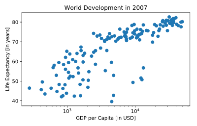

## Labels

It's time to customize your own plot. This is the fun part, you will see your plot come to life!

You're going to work on the scatter plot with world development data: GDP per capita on the x-axis (logarithmic scale), life expectancy on the y-axis. The code for this plot is available in the script.

As a first step, let's add axis labels and a title to the plot. You can do this with the `xlabel()`, `ylabel()` and `title()` functions, available in `matplotlib.pyplot`. This sub-package is already imported as `plt`.

<hr>

**Instructions**
* The strings `xlab` and `ylab` are already set for you. Use these variables to set the label of the x- and y-axis.
* The string `title` is also coded for you. Use it to add a title to the plot.
* After these customizations, finish the script with `plt.show()` to actually display the plot.

## Script
```
# Basic scatter plot, log scale
plt.scatter(gdp_cap, life_exp)
plt.xscale('log')

# Strings
xlab = 'GDP per Capita [in USD]'
ylab = 'Life Expectancy [in years]'
title = 'World Development in 2007'

# Add axis labels
plt.xlabel(xlab)
plt.ylabel(ylab)

# Add title
plt.title(title)

# After customizing, display the plot
plt.show()
```

## Plots
