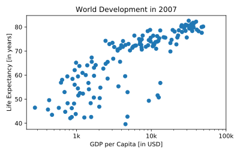

## Ticks

The customizations you've coded up to now are available in the script, in a more concise form.

In the video, Hugo has demonstrated how you could control the y-ticks by specifying two arguments:

> plt.yticks([0,1,2], ["one","two","three"])

In this example, the ticks corresponding to the numbers 0, 1 and 2 will be replaced by one, two and three, respectively.

Let's do a similar thing for the x-axis of your world development chart, with the [`xticks()`](http://matplotlib.org/api/pyplot_api.html#matplotlib.pyplot.xticks) function. The tick values `1000`, `10000` and `100000` should be replaced by `1k`, `10k` and `100k`. To this end, two lists have already been created for you: `tick_val` and `tick_lab`.

<hr>

**Instructions**
* Use `tick_val` and `tick_lab` as inputs to the [`xticks()`](http://matplotlib.org/api/pyplot_api.html#matplotlib.pyplot.xticks) function to make the the plot more readable.
* As usual, display the plot with `plt.show()` after you've added the customizations.

## Script
```
# Scatter plot
plt.scatter(gdp_cap, life_exp)

# Previous customizations
plt.xscale('log')
plt.xlabel('GDP per Capita [in USD]')
plt.ylabel('Life Expectancy [in years]')
plt.title('World Development in 2007')

# Definition of tick_val and tick_lab
tick_val = [1000, 10000, 100000]
tick_lab = ['1k', '10k', '100k']

# Adapt the ticks on the x-axis
plt.xticks(tick_val, tick_lab)

# After customizing, display the plot
plt.show()
```

## Plots
