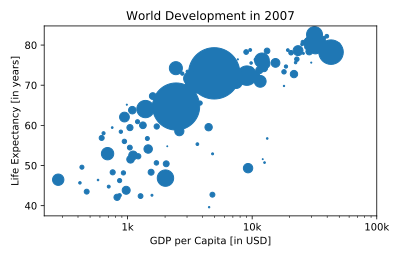

## Sizes

Right now, the scatter plot is just a cloud of blue dots, indistinguishable from each other. Let's change this. Wouldn't it be nice if the size of the dots corresponds to the population?

To accomplish this, there is a list `pop` loaded in your workspace. It contains population numbers for each country expressed in millions. You can see that this list is added to the scatter method, as the argument `s`, for size.

<hr>

**Instructions**
* Run the script to see how the plot changes.
* Looks good, but increasing the size of the bubbles will make things stand out more.
    * Import the `numpy` package as `np`.
    * Use `np.array()` to create a numpy array from the list pop. Call this Numpy array np_pop.
    * Double the values in `np_pop` setting the value of `np_pop` equal to `np_pop * 2`. Because `np_pop` is a Numpy array, each array element will be doubled.
    * Change the s argument inside [`plt.scatter()`](http://matplotlib.org/api/pyplot_api.html#matplotlib.pyplot.scatter) to be `np_pop` instead of pop.

## Script
```
# Import numpy as np
import numpy as np

# Store pop as a numpy array: np_pop
np_pop = np.array(pop)

# Double np_pop
np_pop *= 2

# Update: set s argument to np_pop
plt.scatter(gdp_cap, life_exp, s = np_pop)

# Previous customizations
plt.xscale('log')
plt.xlabel('GDP per Capita [in USD]')
plt.ylabel('Life Expectancy [in years]')
plt.title('World Development in 2007')
plt.xticks([1000, 10000, 100000],['1k', '10k', '100k'])

# Display the plot
plt.show()
```

## Plots
