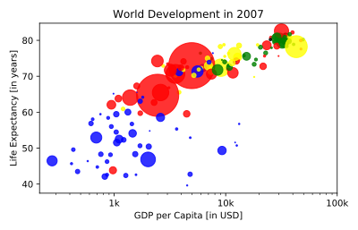

## Colors

The code you've written up to now is available in the script on the right.

The next step is making the plot more colorful! To do this, a list col has been created for you. It's a list with a color for each corresponding country, depending on the continent the country is part of.

How did we make the list `col` you ask? The Gapminder data contains a list `continent` with the continent each country belongs to. A dictionary is constructed that maps continents onto colors:

> ```
> dict = {
>     'Asia':'red',
>     'Europe':'green',
>     'Africa':'blue',
>     'Americas':'yellow',
>     'Oceania':'black'
> }
> ```

Nothing to worry about now; you will learn about dictionaries in the next chapter.

<hr>

**Instructions**
* Add `c = col` to the arguments of the [`plt.scatter()`](http://matplotlib.org/api/pyplot_api.html#matplotlib.pyplot.scatter) function.
* Change the opacity of the bubbles by setting the alpha argument to `0.8` inside [`plt.scatter()`](http://matplotlib.org/api/pyplot_api.html#matplotlib.pyplot.scatter). Alpha can be set from zero to one, where zero is totally transparent, and one is not at all transparent.

## Plots
