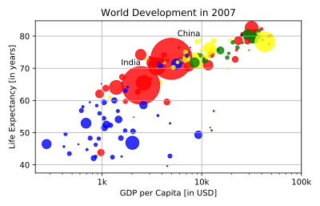

## Additional Customizations

If you have another look at the script, under `# Additional Customizations`, you'll see that there are two [`plt.text()`](http://matplotlib.org/api/pyplot_api.html#matplotlib.pyplot.text) functions now. They add the words `"India"` and `"China"` in the plot.

<hr>

**Instructions**
* Add [`plt.grid(True)`](http://matplotlib.org/api/pyplot_api.html#matplotlib.pyplot.grid) after the [`plt.text()`](http://matplotlib.org/api/pyplot_api.html#matplotlib.pyplot.text) calls so that gridlines are drawn on the plot.

## Script
```
# Scatter plot
plt.scatter(x = gdp_cap, y = life_exp, s = np.array(pop) * 2, c = col, alpha = 0.8)

# Previous customizations
plt.xscale('log')
plt.xlabel('GDP per Capita [in USD]')
plt.ylabel('Life Expectancy [in years]')
plt.title('World Development in 2007')
plt.xticks([1000,10000,100000], ['1k','10k','100k'])

# Additional customizations
plt.text(1550, 71, 'India')
plt.text(5700, 80, 'China')

# Add grid() call
plt.grid(True)

# Show the plot
plt.show()
```

## Plots
