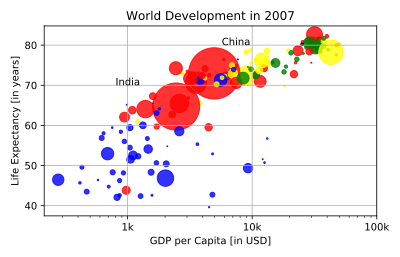

## Interpretation

If you have a look at your colorful plot, it's clear that people live longer in countries with a higher GDP per capita. No high income countries have really short life expectancy, and no low income countries have very long life expectancy. Still, there is a huge difference in life expectancy between countries on the same income level. Most people live in middle income countries where difference in lifespan is huge between countries; depending on how income is distributed and how it is used.

What can you say about the plot?

**Possible Answers**
* The countries in blue, corresponding to Africa, have both low life expectancy and a low GDP per capita.
* There is a negative correlation between GDP per capita and life expectancy.
* China has both a lower GDP per capita and lower life expectancy compared to India.

## Plots
