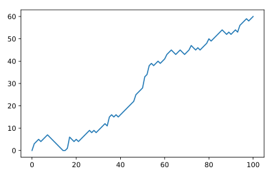

## Visualize the walk

Let's visualize this random walk! Remember how you could use `matplotlib` to build a line plot?

> ```
> import matplotlib.pyplot as plt
> plt.plot(x, y)
> plt.show()
> ```

The first list you pass is mapped onto the `x` axis and the second list is mapped onto the `y` axis.

If you pass only one argument, Python will know what to do and will use the index of the list to map onto the `x` axis, and the values in the list onto the `y` axis.

<hr>

**Instructions**

Add some lines of code after the for loop:
* Import `matplotlib.pyplot` as `plt`.
* Use `plt.plot()` to plot `random_walk`.
* Finish off with `plt.show()` to actually display the plot.

## Script
```
# Numpy is imported, seed is set

# Initialization
random_walk = [0]

for x in range(100) :
    step = random_walk[-1]
    dice = np.random.randint(1,7)

    if dice <= 2:
        step = max(0, step - 1)
    elif dice <= 5:
        step = step + 1
    else:
        step = step + np.random.randint(1,7)

    random_walk.append(step)

# Import matplotlib.pyplot as plt
import matplotlib.pyplot as plt

# Plot random_walk
plt.plot(random_walk)

# Show the plot
plt.show()
```

## Plots
