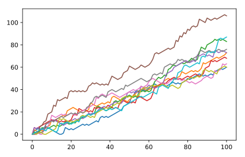

## Visualize all walks

`all_walks` is a list of lists: every sub-list represents a single random walk. If you convert this list of lists to a Numpy array, you can start making interesting plots! `matplotlib.pyplot` is already imported as `plt`.

The nested for loop is already coded for you - don't worry about it. For now, focus on the code that comes after this for loop.

<hr>

**Instructions**
* Use `np.array()` to convert `all_walks` to a Numpy array, `np_aw`.
* Try to use `plt.plot()` on np_aw. Also include `plt.show()`. Does it work out of the box?
* Transpose `np_aw` by calling `np.transpose()` on `np_aw`. Call the result `np_aw_t`. Now every row in `np_all_walks` represents the position after 1 throw for the 10 random walks.
* Use `plt.plot()` to plot `np_aw_t`; also include a `plt.show()`. Does it look better this time?

## Script
```
# numpy and matplotlib imported, seed set.

# initialize and populate all_walks
all_walks = []
for i in range(10) :
    random_walk = [0]
    for x in range(100) :
        step = random_walk[-1]
        dice = np.random.randint(1,7)
        if dice <= 2:
            step = max(0, step - 1)
        elif dice <= 5:
            step = step + 1
        else:
            step = step + np.random.randint(1,7)
        random_walk.append(step)
    all_walks.append(random_walk)

# Convert all_walks to Numpy array: np_aw
np_aw = np.array(all_walks)

# Plot np_aw and show
plt.plot(np_aw)
plt.show()

# Clear the figure
plt.clf()

# Transpose np_aw: np_aw_t
np_aw_t = np.transpose(np_aw)

# Plot np_aw_t and show
plt.plot(np_aw_t)
plt.show()
```

## Plots
