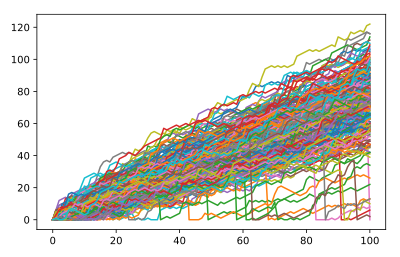

## Implement clumsiness

With this neatly written code of yours, changing the number of times the random walk should be simulated is super-easy. You simply update the `range()` function in the top-level `for` loop.

There's still something we forgot! You're a bit clumsy and you have a 0.1% chance of falling down. That calls for another random number generation. Basically, you can generate a random float between `0` and `1`. If this value is less than or equal to 0.001, you should reset step to 0.

<hr>

**Instructions**
* Change the `range()` function so that the simulation is performed 250 times.
* Finish the `if` condition so that `step` is set to 0 if a random float is less or equal to 0.001. Use `np.random.rand()`.

## Script
```
# numpy and matplotlib imported, seed set

# Simulate random walk 250 times
all_walks = []
for i in range(250) :
    random_walk = [0]
    for x in range(100) :
        step = random_walk[-1]
        dice = np.random.randint(1,7)
        if dice <= 2:
            step = max(0, step - 1)
        elif dice <= 5:
            step = step + 1
        else:
            step = step + np.random.randint(1,7)

        # Implement clumsiness
        if np.random.rand() <= 0.001 :
            step = 0

        random_walk.append(step)
    all_walks.append(random_walk)

# Create and plot np_aw_t
np_aw_t = np.transpose(np.array(all_walks))
plt.plot(np_aw_t)
plt.show()
```

## Plots
