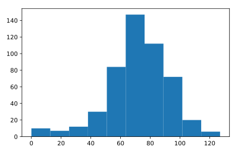

## Plot the distribution

All these fancy visualizations have put us on a sidetrack. We still have to solve the million-dollar problem: W*hat are the odds that you'll reach 60 steps high on the Empire State Building?*

Basically, you want to know about the end points of all the random walks you've simulated. These end points have a certain distribution that you can visualize with a histogram.

Note that if your code is taking too long to run, you might be plotting a histogram of the wrong data!

<hr>

**Instructions**
* To make sure we've got enough simulations, go crazy. Simulate the random walk 500 times.
* From `np_aw_t`, select the last row. This contains the endpoint of all 500 random walks you've simulated. Store this Numpy array as `ends`.
* Use `plt.hist()` to build a histogram of `ends`. Don't forget `plt.show()` to display the plot.

## Script
```
# numpy and matplotlib imported, seed set

# Simulate random walk 500 times
all_walks = []
for i in range(500) :
    random_walk = [0]
    for x in range(100) :
        step = random_walk[-1]
        dice = np.random.randint(1,7)
        if dice <= 2:
            step = max(0, step - 1)
        elif dice <= 5:
            step = step + 1
        else:
            step = step + np.random.randint(1,7)
        if np.random.rand() <= 0.001 :
            step = 0
        random_walk.append(step)
    all_walks.append(random_walk)

# Create and plot np_aw_t
np_aw_t = np.transpose(np.array(all_walks))

# Select last row from np_aw_t: ends
ends = np_aw_t[-1,:]

# Plot histogram of ends, display plot
plt.hist(ends)
plt.show()
```

## Plots
