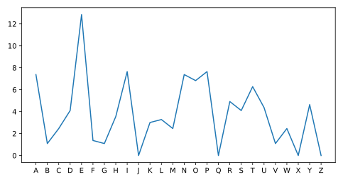

## Correcting a function error

The code in the script editor should plot information from the DataFrame that we loaded in the previous exercise.

However, there is an error in function syntax. Remember that common function errors include:

* Forgetting closing parenthesis
* Forgetting commas between each argument

Note that all arguments to the functions are correct. The problem is in the function syntax.

<hr>

**Instructions**
* Correct the code so that it runs without syntax errors

## Script
```
# One or more of the following lines contains an error
# Correct it so that it runs without producing syntax errors

# Plot a graph
plt.plot(x_values, y_values)

# Display the graph
plt.show()
```

## Plots
