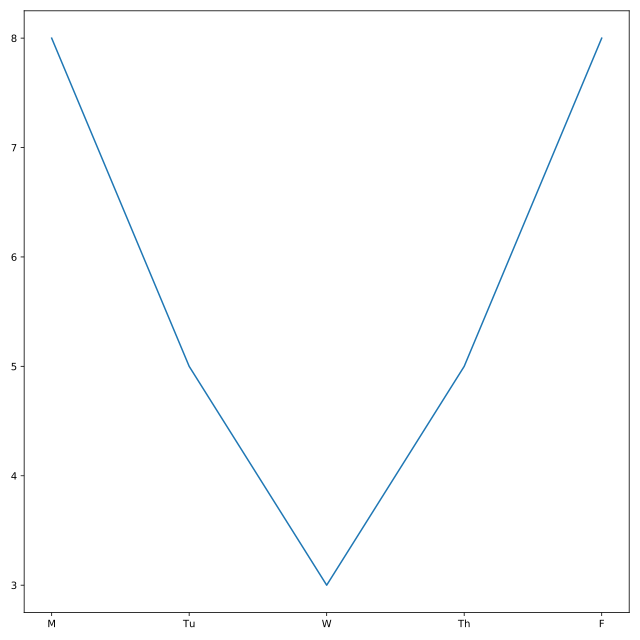

## Working hard

Several police officers have been working hard to help us solve the mystery of Bayes, the kidnapped Golden Retriever. Their commanding officer wants to know exactly how hard each officer has been working on this case. Officer Deshaun has created DataFrames called deshaun to track the amount of time he spent working on this case. The DataFrame contains two columns:

* `day_of_week`: a string representing the day of the week
* `hours_worked`: the number of hours that a particular officer worked on the Bayes case'

<hr>

**Instructions 1/3**
* From `matplotlib`, import the module `pyplot` under the alias p`lt

**Instructions 2/3**
* Plot Officer Deshaun's hours worked using the columns `day_of_week` and `hours_worked` from `deshaun`.

**Instructions 3/3**
* Display the plot.

## Script
```
# From matplotlib, import pyplot under the alias plt
from matplotlib import pyplot as plt

# Plot Officer Deshaun's hours_worked vs. day_of_week
plt.plot(deshaun.day_of_week, deshaun.hours_worked)

# Display Deshaun's plot
plt.show()
```

## Plots
