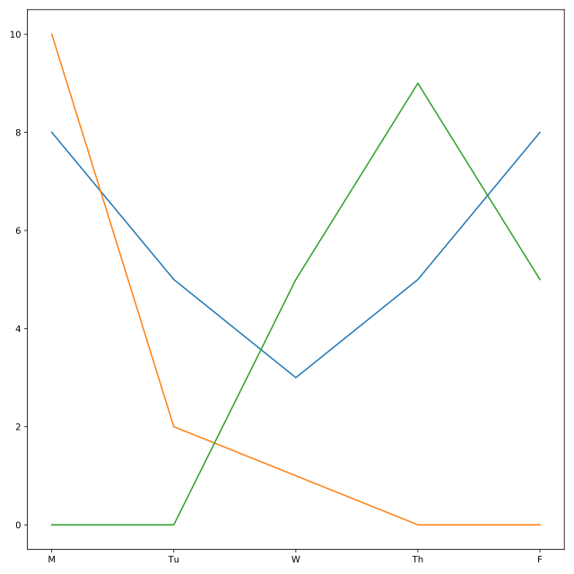

## Or hardly working?

Two other officers have been working with Deshaun to help find Bayes. Their names are Officer Mengfei and Officer Aditya. Deshaun used their time cards to create two more DataFrames: `mengfei` and `aditya`. In this exercise, we'll plot all three lines together to see who was working hard each day.

We've already loaded `matplotlib` under the alias `plt`.

<hr>

**Instructions 1/2**
* Plot Officer Aditya's time worked with `day_of_week` on the x-axis and `hours_worked` on the y-axis.
* Plot Officer Mengfei's time worked with `day_of_week` on the x-axis and `hours_worked` on the y-axis.

**Instructions 2/2**
> **Question**
>
> One of the officers was removed from the investigation on Wednesday because of an emergency at a different station house. That office did not return on Thursday or Friday. Which color line represents that officer?
>
> **Possible Answers**
> * blue
> * green
> * orange
> 
> **Answer**
> > orange

## Script
```
# Plot Officer Deshaun's hours_worked vs. day_of_week
plt.plot(deshaun.day_of_week, deshaun.hours_worked)

# Plot Officer Aditya's hours_worked vs. day_of_week
plt.plot(aditya.day_of_week, aditya.hours_worked)

# Plot Officer Mengfei's hours_worked vs. day_of_week
plt.plot(mengfei.day_of_week, mengfei.hours_worked)

# Display all three line plots
plt.show()
```

## Plots
