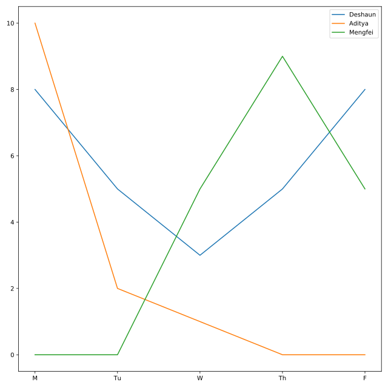

## Adding a legend

Officers Deshaun, Mengfei, and Aditya have all been working with you to solve the kidnapping of Bayes. Their supervisor wants to know how much time each officer has spent working on the case.

Deshaun created a plot of data from the DataFrames `deshaun`, `mengfei`, and `aditya` in the previous exercise. Now he wants to add a legend to distinguish the three lines.

<hr>

**Instructions 1/4**
* Using the keyword `label`, label Deshaun's plot as `"Deshaun"`.

**Instructions 2/4**
* Add labels to Mengfei's (`"Mengfei"`) and Aditya's (`"Aditya"`) plots.

**Instructions 3/4**
* Nothing is displaying yet! Add a command to make the legend display.

**Instructions 4/4**
> **Question**
>
> One of the officers did not start working on the case until Wednesday. Which officer?
>
> **Possible Answers**
> * Deshaun
> * Aditya
> * Mengfei
>
> **Answer**
> > Mengfei

## Script
```
# Add a label to Deshaun's plot
plt.plot(deshaun.day_of_week, deshaun.hours_worked, label='Deshaun')

# Officer Aditya
plt.plot(aditya.day_of_week, aditya.hours_worked)

# Officer Mengfei
plt.plot(mengfei.day_of_week, mengfei.hours_worked)

# Display plot
plt.show()
```

## Plots
