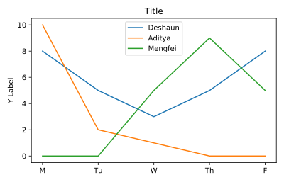

## Adding labels

If we give a chart with no labels to Officer Deshaun's supervisor, she won't know what the lines represent.

We need to add labels to Officer Deshaun's plot of hours worked.

<hr>

**Instructions**
* Add a descriptive title to the chart.
* Add a label for the y-axis.

## Script
```
# Lines
plt.plot(deshaun.day_of_week, deshaun.hours_worked, label='Deshaun')
plt.plot(aditya.day_of_week, aditya.hours_worked, label='Aditya')
plt.plot(mengfei.day_of_week, mengfei.hours_worked, label='Mengfei')

# Add a title
plt.title('Title')

# Add y-axis label
plt.ylabel('Y Label')

# Legend
plt.legend()
# Display plot
plt.show()
```

## Plots
