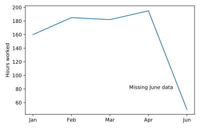

## Adding floating text

Officer Deshaun is examining the number of hours that he worked over the past six months. The number for June is low because he only had data for the first week. Help Deshaun add an annotation to the graph to explain this.

<hr>

**Instructions**
* Place the annotation `"Missing June data"` at the point (`2.5`, `80`)

## Script
```
# Create plot
plt.plot(six_months.month, six_months.hours_worked)

# Add annotation "Missing June data" at (2.5, 80)
plt.text(2.5, 80, "Missing June data")

# Display graph
plt.show()
```

## Plots
