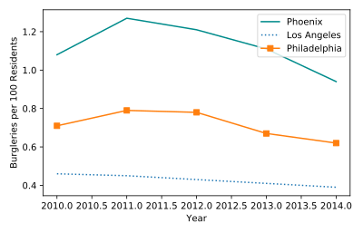

## Tracking crime statistics

Sergeant Laura wants to do some background research to help her better understand the cultural context for Bayes' kidnapping. She has plotted Burglary rates in three U.S. cities using data from the [Uniform Crime Reporting Statistics](https://www.ucrdatatool.gov/Search/Crime/Local/LocalCrimeLarge.cfm).

She wants to present this data to her officers, and she wants the image to be as beautiful as possible to effectively tell her data story.

Recall:
* You can change `linestyle` to dotted (`':'`), dashed(`'--'`), or no line (`''`).
* You can change the `marker` to circle (`'o'`), diamond(`'d'`), or square (`'s'`).

<hr>

**Instructions**
* Change the color of Phoenix to `"DarkCyan"`.
* Make the Los Angeles line dotted.
    Add square markers to Philadelphia.

## Script
```
# Change the color of Phoenix to `"DarkCyan"`
plt.plot(data["Year"], data["Phoenix Police Dept"], label="Phoenix", color='DarkCyan')

# Make the Los Angeles line dotted
plt.plot(data["Year"], data["Los Angeles Police Dept"], label="Los Angeles", linestyle=':')

# Add square markers to Philedelphia
plt.plot(data["Year"], data["Philadelphia Police Dept"], label="Philadelphia", marker='s')

# Add a legend
plt.legend()

# Display the plot
plt.show()
```

## Plots
