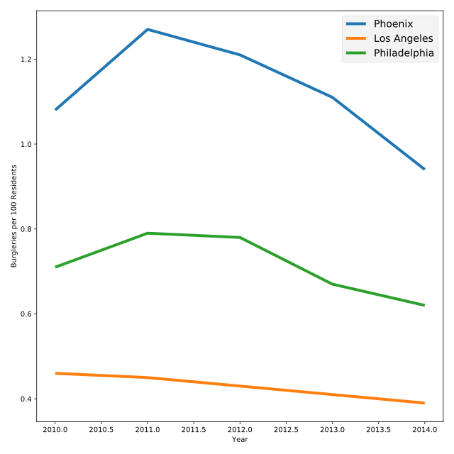

## Playing with styles

Help Sergeant Laura wants to try out a few different style options. Changing the plotting style is a fast way to change the entire look of your plot without having to update individual colors or line styles. Some popular styles include:

* `'fivethirtyeight'` - Based on the color scheme of the popular website
* `'grayscale'` - Great for when you don't have a color printer!
* `'seaborn'` - Based on another Python visualization library
* `'classic'` - The default color scheme for Matplotlib

<hr>

**Instructions 1/3**
* Change the plotting style to `"fivethirtyeight"`.
* Change the plotting style to `"ggplot"`.
* View all styles by typing `print(plt.style.available)` in the console
* Pick one of those styles and see what it looks like

## Script
```
# Change the style to fivethirtyeight
plt.style.use('fivethirtyeight')

# Plot lines
plt.plot(data["Year"], data["Phoenix Police Dept"], label="Phoenix")
plt.plot(data["Year"], data["Los Angeles Police Dept"], label="Los Angeles")
plt.plot(data["Year"], data["Philadelphia Police Dept"], label="Philadelphia")

# Add a legend
plt.legend()

# Display the plot
plt.show()
```

## Plots
