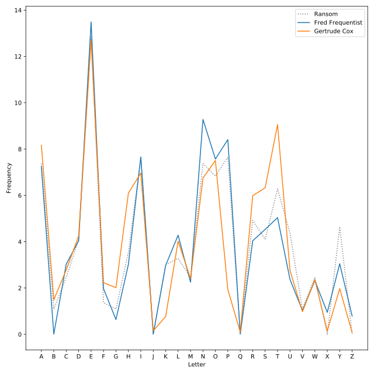

## Identifying Bayes' kidnapper

We've narrowed the possible kidnappers down to two suspects:

* Fred Frequentist (`suspect1`)
* Gertrude Cox (`suspect2`)

The kidnapper left a long ransom note containing several unusual phrases. Help DataCamp by using a line plot to compare the frequency of letters in the ransom note to samples from the two main suspects.

Three DataFrames have been loaded:

* `ransom` contains the letter frequencies for the ransom note.
* `suspect1` contains the letter frequencies for the sample from Fred Frequentist.
* `suspect2` contains the letter frequencies for the sample from Gertrude Cox.

Each DataFrame contain two columns `letter` and `frequency`.

<hr>

**Instructions 1/4**
* Plot the letter frequencies from the ransom note. The x-values should be `ransom.letter`. The y-values should be `ransom.frequency`. The label should be the string `'Ransom'`. The line should be dotted and `gray`.

**Instructions 2/4**
* Plot a line for the data in `suspect1`. Use a keyword argument to label that line `'Fred Frequentist'`).

**Instructions 3/4**
* Plot a line for the data in `suspect2` (labeled `'Gertrude Cox`').

**Instructions 4/4**
* Label the x-axis (`Letter`) and the y-axis (`Frequency`), and add a legend.


## Script
```
# x should be ransom.letter and y should be ransom.frequency
plt.plot(ransom.letter, ransom.frequency,
         # Label should be "Ransom"
         label="Ransom",
         # Plot the ransom letter as a dotted gray line
         linestyle=':', color='gray')

# Display the plot
plt.show()
```
```
...
# X-values should be suspect1.letter
# Y-values should be suspect1.frequency
# Label should be "Fred Frequentist"
plt.plot(suspect1.letter, suspect1.frequency, label='Fred Frequentist')
...
```
```
...
# X-values should be suspect2.letter
# Y-values should be suspect2.frequency
# Label should be "Gertrude Cox"
plt.plot(suspect2.letter, suspect2.frequency,
         label='Gertrude Cox')
...
```
```
...
# Add x- and y-labels
plt.xlabel("Letter")
plt.ylabel("Frequency")

# Add a legend
plt.legend()
...
```

## Plots
