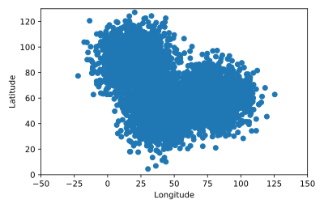

## Charting cellphone data

We know that Freddy Frequentist is the one who kidnapped Bayes the Golden Retriever. Now we need to learn where he is hiding.

Our friends at the police station have acquired cell phone data, which gives some of Freddie's locations over the past three weeks. It's stored in the DataFrame `cellphone`. The x-coordinates are in the column `'x'` and the y-coordinates are in the column `'y'`.

The matplotlib module has been imported under the alias `plt`.

<hr>

**Instructions**
* Display the first five rows of the DataFrame and determine which columns to plot
* Create a scatter plot of the data in `cellphone`.

## Script
```
# Explore the data
print(cellphone.head())

# Create a scatter plot of the data from the DataFrame cellphone
plt.scatter(cellphone.x, cellphone.y)

# Add labels
plt.ylabel('Latitude')
plt.xlabel('Longitude')

# Display the plot
plt.show()
```

## Plots
