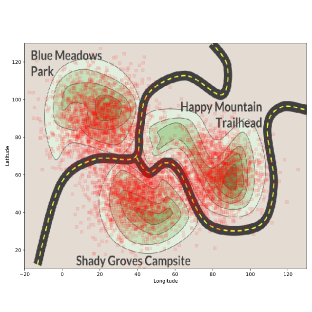

## Modifying a scatterplot

In the previous exercise, we created a scatter plot to show Freddy Frequentist's cell phone data.

In this exercise, we've done some magic so that the plot will appear over a map of our town. If we just plot the data as we did before, we won't be able to see the map or pick out the areas with the most points. We can fix this by changing the colors, markers, and transparency of the scatter plot.

As before, the `matplotlib` module has been imported under the alias `plt`, and the cellphone data is in the DataFrame cellphone.

<hr>

**Instructions 1/3**
* Change the color of the points to 'red'.

**Instructions 2/3**
* Change the marker shape to square.

**Instructions 3/3**
* Change the transparency of the scatterplot to 0.1.

## Script
```
# Change the transparency to 0.1
plt.scatter(cellphone.x, cellphone.y,
           color='red',
           marker='s',
           alpha=0.1)

# Add labels
plt.ylabel('Latitude')
plt.xlabel('Longitude')

# Display the plot
plt.show()
```

## Plots
