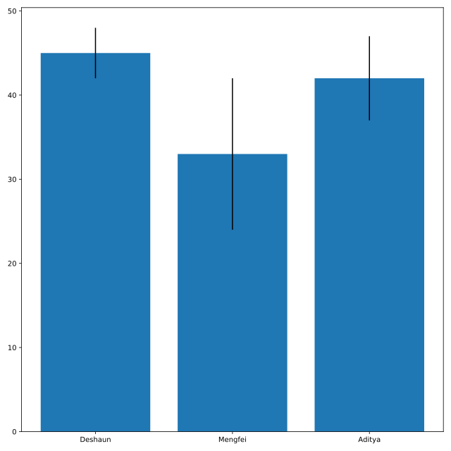

## Build a simple bar chart

Officer Deshaun wants to plot the average number of hours worked per week for him and his coworkers. He has stored the hours worked in a DataFrame called `hours`, which has columns `officer` and `avg_hours_worked`. Recall that the function `plt.bar()` takes two arguments: the labels for each bar, and the height of each bar. Both of these can be found in our DataFrame.

<hr>

**Instructions 1/3**
* Display the DataFrame `hours` using a `print` command.

**Instructions 2/3**
* Create a bar chart of the column `avg_hours_worked` for each `officer` from the DataFrame `hours`.

**Instructions 2/3**
* Use the column `std_hours_worked` (the standard deviation of the hours worked) to add error bars to the bar chart.

## Script
```
# Display the DataFrame hours using print
print(hours)

# Create a bar plot from the DataFrame hours
plt.bar(hours.officer, hours.avg_hours_worked,
        # Add error bars
        yerr=hours.std_hours_worked)

# Display the plot
plt.show()
```

## Output
```
<script.py> output:
       officer  avg_hours_worked  std_hours_worked
    0  Deshaun                45                 3
    1  Mengfei                33                 9
    2   Aditya                42                 5
```

## Plots
