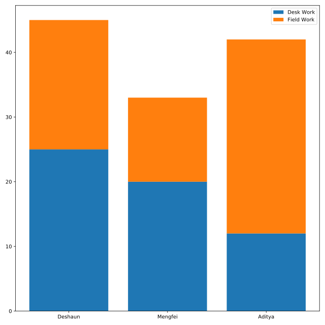

## Where did the time go?

Officer Deshaun wants to compare the hours spent on field work and desk work between him and his colleagues. In this DataFrame, he has split out the average hours worked per week into `desk_work` and `field_work`.

You can use the same DataFrame containing the hours worked from the previous exercise (`hours`).

**Instructions 1/2**
* Create a bar plot of the time each officer spends on desk_work.
* Label that bar plot "Desk Work".

**Instructions 2/2**
* Create a bar plot for `field_work` whose `bottom` is the height of `desk_work`.
* Label the `field_work` bars as `"Field Work"` and add a legend.

## Script
```
# Plot the number of hours spent on desk work
plt.bar(hours.officer, hours.desk_work, label='Desk Work')

# Plot the hours spent on field work on top of desk work
plt.bar(hours.officer, hours.field_work, label='Field Work', bottom=hours.desk_work)

# Add a legend
plt.legend()

# Display the plot
plt.show()
```

## Plots
