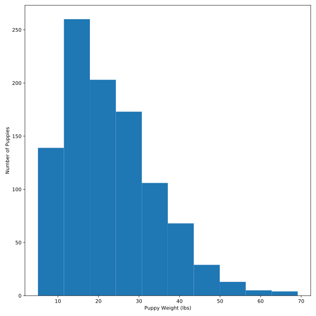
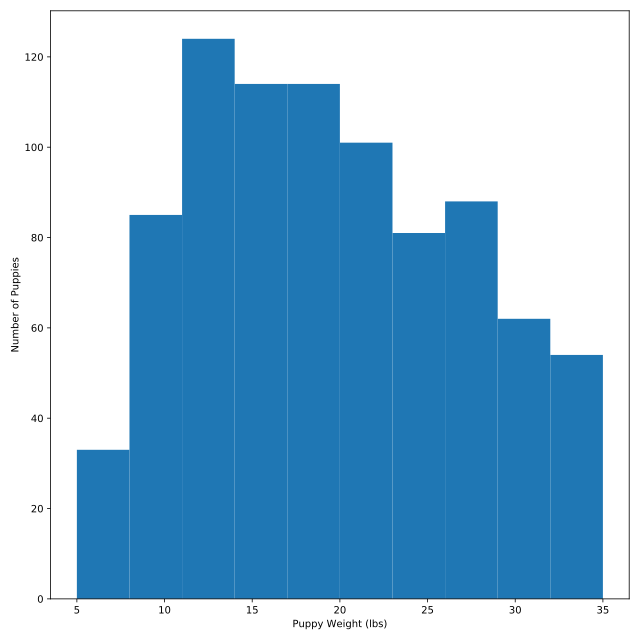

## Modifying histograms

Let's explore how changes to keyword parameters in a histogram can change the output. Recall that:

* `range` sets the minimum and maximum datapoints that we will include in our histogram.
* `bins` sets the number of points in our histogram.

We'll be exploring the weights of various puppies from the DataFrame `puppies`. `matplotlib` has been loaded under the alias `plt`.

<hr>

**Instructions 1/3**
* Create a histogram of the column `weight` from the DataFrame `puppies`.

**Instructions 2/3**
* Change the number of bins to 50.

**Instructions 3/3**
* Change the range to start at 5 and end at 35.

## Script
```
# Create a histogram of the column weight
# from the DataFrame puppies
plt.hist(puppies.weight, bins=10)

# Add labels
plt.xlabel('Puppy Weight (lbs)')
plt.ylabel('Number of Puppies')

# Display
plt.show()
```
```
# Change the number of bins to 50
plt.hist(puppies.weight,
        bins=50)
...
```
```
# Change the range to start at 5 and end at 35
plt.hist(puppies.weight,
        range=(5,35))
...
```

## Plots
\
\
