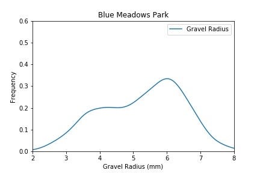
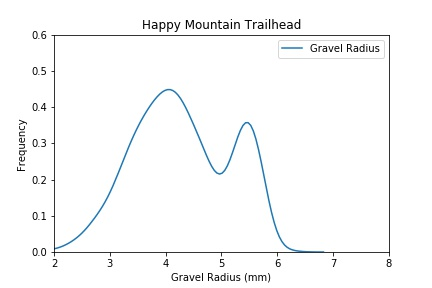
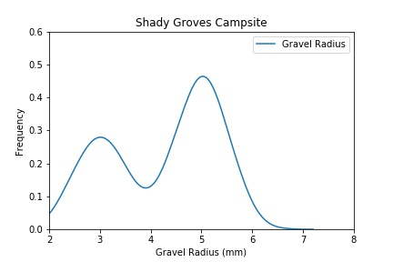
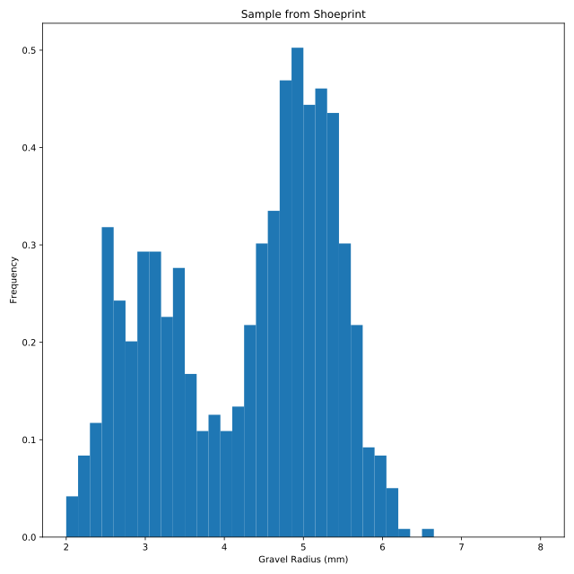

## Heroes with histograms

We've identified that the kidnapper is Fred Frequentist. Now we need to know where Fred is hiding Bayes.

A shoe print at the crime scene contains a specific type of gravel. Based on the distribution of gravel radii, we can determine where the kidnapper recently visited. It might be:

* \
* \
* 

The radii of individual gravel pieces has been loaded into the DataFrame `gravel`, and `matplotlib` has been loaded under the alias `plt`.

<hr>

**Instructions 1/4**
* Create a histogram of `gravel.radius`.

**Instructions 2/4**
* Modify the histogram such that the histogram is divided into `40` bins and the range is from `2` to `8`.

**Instructions 3/4**
* Normalize your histogram so that the sum of the bins adds to 1.

**Instructions 4/4**
* Label the x-axis (`Gravel Radius (mm)`), the y-axis (`Frequency`), and the title(`Sample from Shoeprint`).

## Script
```
# Create a histogram
plt.hist(gravel.radius,
         bins=40,
         range=(2, 8),
         density=True)

# Label plot
plt.xlabel('Gravel Radius (mm)')
plt.ylabel('Frequency')
plt.title('Sample from Shoeprint')

# Display histogram
plt.show()
```
## Plots
