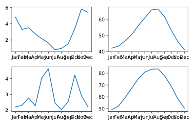

## Creating small multiples with plt.subplots

Small multiples are used to plot several datasets side-by-side. In Matplotlib, small multiples can be created using the `plt.subplots()` function. The first argument is the number of rows in the array of Axes objects generate and the second argument is the number of columns. In this exercise, you will use the Austin and Seattle data to practice creating and populating an array of subplots.

The data is given to you in DataFrames: `seattle_weather` and `austin_weather`. These each have a `MONTH` column and `MLY-PRCP-NORMAL` (for average precipitation), as well as `MLY-TAVG-NORMAL` (for average temperature) columns. In this exercise, you will plot in a separate subplot the monthly average precipitation and average temperatures in each city.

<hr>

**Instructions**
* Create a Figure and an array of subplots with 2 rows and 2 columns.
* Addressing the top left Axes as index 0, 0, plot the Seattle precipitation.
* In the top right (index 0,1), plot Seattle temperatures.
* In the bottom left (1, 0) and bottom right (1, 1) plot Austin precipitations and temperatures.

## Script
```
# Create a Figure and an array of subplots with 2 rows and 2 columns
fig, ax = plt.subplots(2, 2)

# Addressing the top left Axes as index 0, 0, plot month and Seattle precipitation
ax[0, 0].plot(seattle_weather['MONTH'], seattle_weather['MLY-PRCP-NORMAL'])

# In the top right (index 0,1), plot month and Seattle temperatures
ax[0, 1].plot(seattle_weather['MONTH'], seattle_weather['MLY-TAVG-NORMAL'])

# In the bottom left (1, 0) plot month and Austin precipitations
ax[1, 0].plot(austin_weather['MONTH'], austin_weather['MLY-PRCP-NORMAL'])

# In the bottom right (1, 1) plot month and Austin temperatures
ax[1, 1].plot(austin_weather['MONTH'], austin_weather['MLY-TAVG-NORMAL'])

plt.show()
```

## Plots
