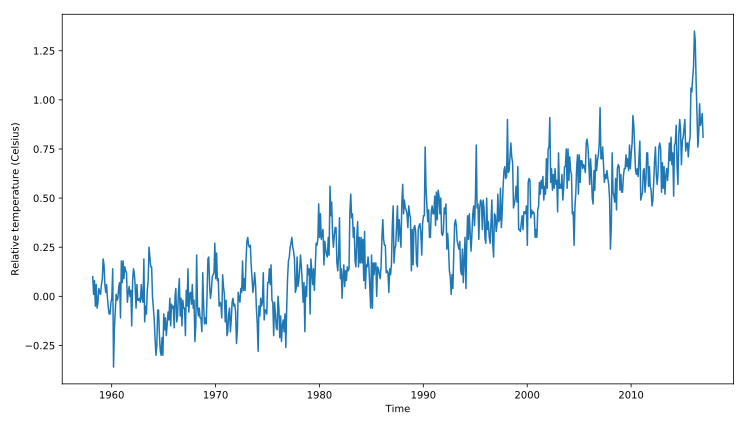

## Plot time-series data

To plot time-series data, we use the `Axes` object `plot` command. The first argument to this method are the values for the x-axis and the second argument are the values for the y-axis.

This exercise provides data stored in a DataFrame called `climate_change`. This variable has a time-index with the dates of measurements and two data columns: `"co2"` and `"relative_temp"`.

In this case, the index of the DataFrame would be used as the x-axis values and we will plot the values stored in the `"relative_temp"` column as the y-axis values. We will also properly label the x-axis and y-axis.

<hr>

**Instructions**

* Add the data from `climate_change` to the plot: use the DataFrame `index` for the x value and the `"relative_temp"` column for the y values.
* Set the x-axis label to `'Time'`.
* Set the y-axis label to `'Relative temperature (Celsius)'`.
* Show the figure.

## Script
```
import matplotlib.pyplot as plt
fig, ax = plt.subplots()

# Add the time-series for "relative_temp" to the plot
ax.plot(climate_change.index, climate_change['relative_temp'])

# Set the x-axis label
ax.set_xlabel('Time')

# Set the y-axis label
ax.set_ylabel('Relative temperature (Celsius)')

# Show the figure
plt.show()
```

## Plots
