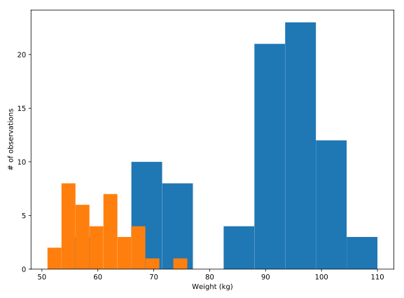

## Creating histograms

Histograms show the full distribution of a variable. In this exercise, we will display the distribution of weights of medalists in gymnastics and in rowing in the 2016 Olympic games for a comparison between them.

You will have two DataFrames to use. The first is called `mens_rowing` and includes information about the medalists in the men's rowing events. The other is called `mens_gymnastics` and includes information about medalists in all of the Gymnastics events.

<hr>

**Instructions**

* Use the `ax.hist` method to add a histogram of the "Weight" column from the `mens_rowing` DataFrame.
* Use `ax.hist` to add a histogram of "Weight" for the `mens_gymnastics` DataFrame.
* Set the x-axis label to "Weight (kg)" and the y-axis label to "# of observations".

## Script
```
fig, ax = plt.subplots()
# Plot a histogram of "Weight" for mens_rowing
ax.hist(mens_rowing.Weight)

# Compare to histogram of "Weight" for mens_gymnastics
ax.hist(mens_gymnastics.Weight)

# Set the x-axis label to "Weight (kg)"
ax.set_xlabel('Weight (kg)')

# Set the y-axis label to "# of observations"
ax.set_ylabel('# of observations')

plt.show()
```

## Plot
