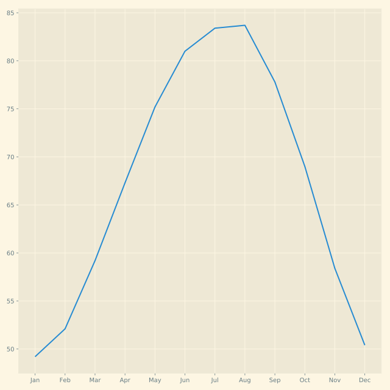

## Switching between styles

Selecting a style to use affects all of the visualizations that are created after this style is selected.

Here, you will practice plotting data in two different styles. The data you will use is the same weather data we used in the first lesson: you will have available to you the DataFrame `seattle_weather` and the DataFrame `austin_weather`, both with records of the average temperature in every month.

<hr>

**Instructions 1/2**

> Select the `'ggplot'` style, create a new Figure called `fig`, and a new Axes object called `ax` with `plt.subplots`.

**Instructions 2/2**

> Select the 'Solarize_Light2' style, create a new Figure called fig, and a new Axes object called ax with plt.subplots.

## Script
```
# Use the "ggplot" style and create new Figure/Axes
plt.style.use('ggplot')
fig, ax = plt.subplots()
ax.plot(seattle_weather["MONTH"], seattle_weather["MLY-TAVG-NORMAL"])
plt.show()
```
```
# Use the "Solarize_Light2" style and create new Figure/Axes
plt.style.use('Solarize_Light2')
fig, ax = plt.subplots()
ax.plot(austin_weather["MONTH"], austin_weather["MLY-TAVG-NORMAL"])
plt.show()
```

## Plots

